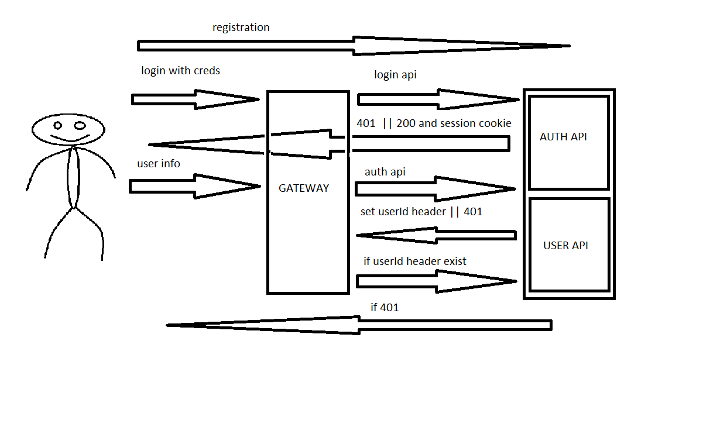

Команда для запуска:
1. minikube addons enable ingress
2. kubectl apply -f namespaces.yaml
3. kubectl apply -f app

В файле hw5.postman_collection.json запросы для проверки с помощью postman

Описание:
Приложение состоит из API GATEWAY и сервиса, содержащего API для работы с пользовательской информацией
и аутентификации. 

Сценарий использования:
1. Регистрация.
2. Аутентификация. На этом этапе при успешной аутентификацие создается сессионная кука.
3. Запрос ресурса. 
4. Gateway запрашивает проверку аутентификации. 
Если проверка пройдена устанавливается header, содержащий ID пользователя. 
5. Gateway перенаправляет запрос, содежращий ID пользователя сервису, 
отвечающему за работу с пользовательской информацией. Который основываясь на userId 
позволяет работать только с данными, относящимися к аутентифицированному пользователю.
6. Если на 2, 4 шагах проверка не пройдена возвращается 401.

