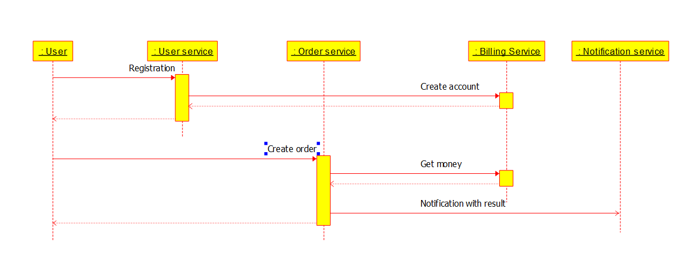

Команда для запуска:
1. minikube addons enable ingress
2. kubectl apply -f namespaces.yaml 
3. kubectl apply -f kafka/kafka-crd.yaml -n apps 
4. kubectl apply -f kafka/kafka-persistent-single.yaml -n apps 
5. kubectl apply -f apps

В файле hw6.postman_collection.json запросы для проверки с помощью postman

Описание:
Приложение состоит из API GATEWAY и сервисов для работы с информацией о пользователе, заказом, 
биллингом и нотификациями. При регистрации пользователя создается аккаунт в биллинге с нулевым остатком.
Пользователь может пополнить баланс или потратить деньги на заказ. При создании заказа сервис заказа 
обращается к биллингу для снятия денег, если денег на счету достаточно то сумма снимается и отправляется 
сообщение в сервис нотификаций об успешной операции. Если денег на счету не достаточно то баланс не меняется
и отправляется сообщение об ошибке. Общение сервиса заказов с сервисом нотификаций происходит ассинхронно через кафку.
Остальное синхронно по ресту.

